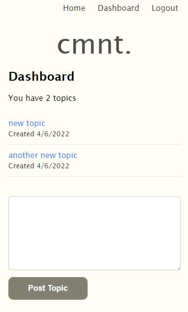
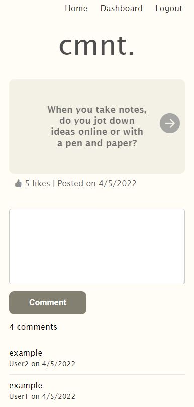

# Cmnt. A topic-based discussion app

## Description

Cmnt is a Node.js application that greets the user with a random topic that they can comment on. The app relies on randomness to get you out of your comfort zone to comment on things you might not comment on usually. You can click forward and back to get additional random topics. You can also post a topic from your dashboard.

It utilizes the following features:
- Node.js
- Express.js
- API
- MySQL and Sequelize DB
- Handlebars template engine
- Fully deployed stand-alone application on Heroku

## Table of Contents

- [Description](#description)
- [Installation](#installation)
- [Usage](#usage)
- [License](#license)
- [Contributing](#contributing)
- [Questions](#questions)

## Installation

- Download or clone the project files to your local system
- Download and install Node.js if you don't have it already
- Open a terminal window
- Navigate to the directory in which you placed the project files
- Type the command 'npm install' to install all project dependencies

## Usage

- Follow instructions from the installation section
- Open a terminal window
- Navigate to the directory you saved your project files in
- Open MySQL and create the database with 'source db/schema.sql'
- Run 'node seeds/index' to seed the database
- Type the command 'node server' to initialize and run the server
- Navigate to 'http://localhost:3001'
- Use the interface to create an account and then browse topics and comment

-- Deployed Link Placeholder--

### Screenshot:

## License

This project is covered under the [GNU General Public License v3.0](https://www.gnu.org/licenses/)

## Contributing

Project created by:
- Brandon Balatbat
- Elijah Johnson
- Jon Mooney
- Mark Protsyuk
- Raymund Ofina
- Rider Cogswell

If you wish to contribute to this project, follow these steps:

- Fork the repository
- Clone or download to your local
- Make any changes/updates and push to your remote fork
- Start a pull request

## Questions

Questions? Please visit one of the contributors GitHub profiles and find their contact info